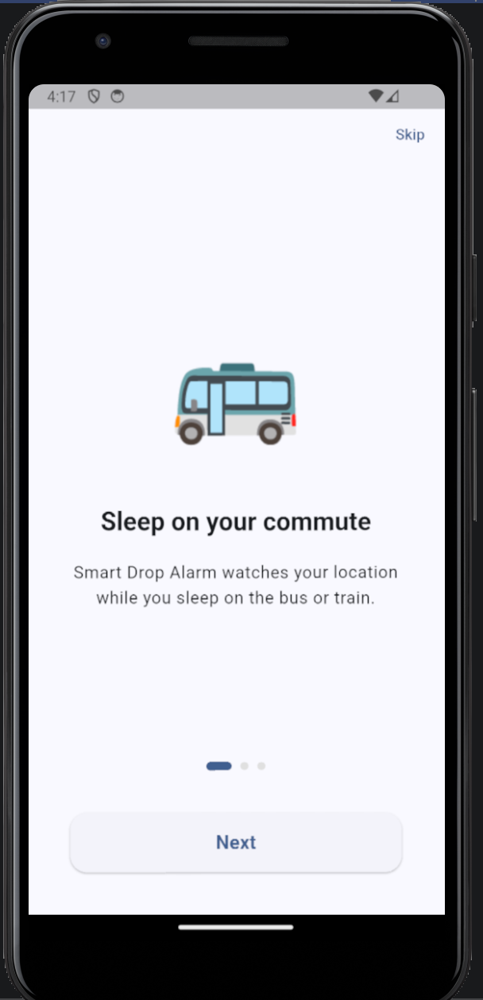
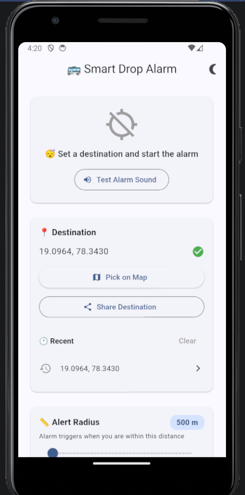
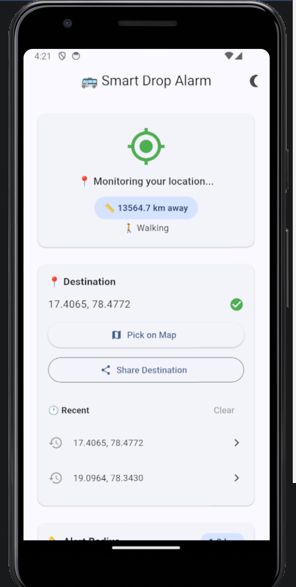
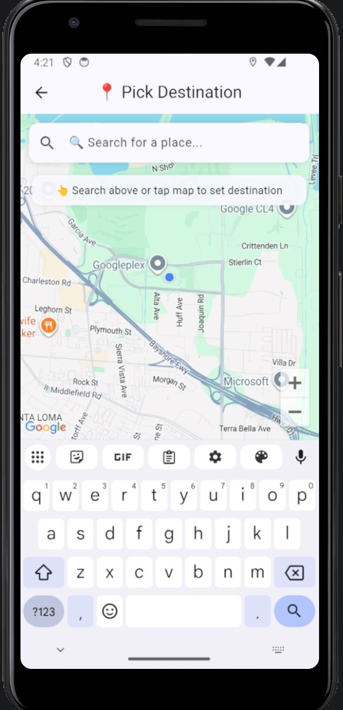
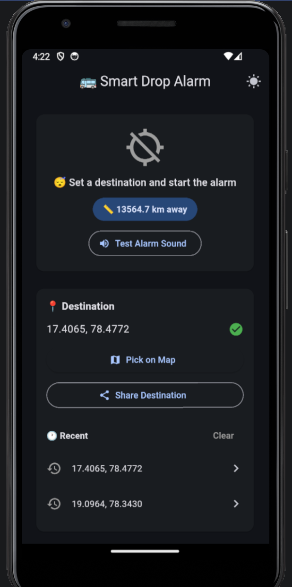
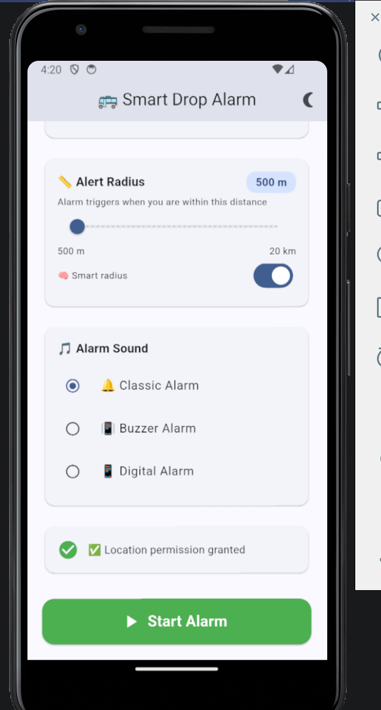

# 🚌 Smart Drop Alarm

A GPS-based alarm app for sleeping travellers that alerts you when you're near your destination — so you never miss your stop again.

Built with Flutter as a personal project to solve a real problem: falling asleep on public transport.

---

## 📸 Screenshots

| Onboarding | Home Screen | Active Alarm |
|-----------|-------------|--------------|
|  |  |  |

| Map Picker | Dark Mode | Features |
|-----------|-----------|----------|
|  |  |  |

---

## 📱 Features

- 📍 **Google Maps destination picker** — tap anywhere on the map to set your stop
- 🔍 **Search bar** — search any place by name
- 🛰️ **Live GPS monitoring** — tracks your location in the background
- 🔔 **Smart alarm** — sound, vibration and full-screen alert when you arrive
- 🧠 **Adaptive radius** — auto-adjusts alert distance based on your speed (walking/bus/highway)
- ⏱️ **ETA calculation** — shows estimated time to destination
- 🔊 **Voice alerts** — announces your stop as you approach
- 💤 **Smart snooze** — silences alarm but keeps GPS monitoring
- 🕐 **Recent destinations** — remembers your last 5 stops
- 🎵 **Custom alarm sounds** — choose from multiple alarm tones
- 🌙 **Dark/Light mode** — manual toggle
- 🔋 **Battery warning** — alerts if battery saver may kill GPS
- 📤 **Share destination** — send your stop via WhatsApp/SMS
- 🛡️ **Safety mode** — escalates alarm if you don't respond
- 👋 **Onboarding** — smooth 3-step intro for first time users

---

## 🛠️ Tech Stack

| Layer | Technology |
|-------|-----------|
| Framework | Flutter (Dart) |
| State Management | Provider |
| Maps | Google Maps SDK |
| GPS | Geolocator |
| Background Service | flutter_background_service |
| Notifications | flutter_local_notifications |
| Audio | audioplayers |
| Voice | flutter_tts |
| Storage | SharedPreferences |

---

## 🚀 Getting Started

### Prerequisites
- Flutter SDK
- Android Studio / VS Code
- Google Maps API key (restricted to your package + SHA1)

### Setup
```bash
git clone https://github.com/Vedamsh27/smart-drop-alarm.git
cd smart-drop-alarm
flutter pub get
```

Add your Google Maps API key to `android/local.properties`:
```
MAPS_API_KEY=your_api_key_here
```

Then run:
```bash
flutter run
```

---

## 📦 Download APK

Download the latest release APK from the [Releases](https://github.com/Vedamsh27/smart-drop-alarm/releases) page.

---

## 🏗️ Architecture
```
lib/
├── models/          # Data models
├── providers/       # State management (Provider)
├── screens/         # UI screens
│   ├── home_screen.dart
│   ├── map_picker_screen.dart
│   ├── alarm_screen.dart
│   └── onboarding_screen.dart
├── services/        # Business logic
│   ├── alarm_service.dart
│   ├── background_service.dart
│   ├── distance_service.dart
│   ├── location_service.dart
│   ├── prediction_service.dart
│   ├── voice_service.dart
│   └── safety_service.dart
└── main.dart
```

---

## 👨‍💻 Author

**Vedamsh** — [GitHub](https://github.com/Vedamsh27)

---

## 📄 License

This project is for personal and educational use.
